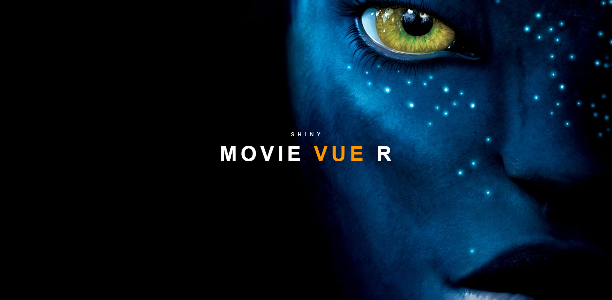

# Shiny-movie-Vue-r

##### What is it?

Shiny / Vue hybrid app using an HTMLTemplate. The app uses:

1. [Vue](https://vuejs.org/)
2. [vuetify](https://vuetifyjs.com/en/getting-started/installation/)
3. [material design icons](https://materialdesignicons.com/)
4. [vuex](https://vuex.vuejs.org/guide/)
5. [Vue-i18n](https://kazupon.github.io/vue-i18n/) 
6. [billboard.js](https://naver.github.io/billboard.js/)
7. [lodash.js](https://lodash.com/)
8. [d3.js](https://d3js.org/)
9. [mitt.js](https://github.com/developit/mitt)

##### Why create this?

The app shows more advanced use of Vue in concert with R. Even though Shiny is great, especially if you are a web app novice. However, making more complex UIs or UX experiences becomes exceedingly more cumbersome when the app size grows. 

Most UI things are very easily done in Vue, while harder in R. jQuery is also quite old these days and better, more reactive systems are available.

This app shows intermediate Shiny enthusiasts how to expand their horizons to incorporate the power of modern JavaScript frameworks such as Vue and tap into the world of modern design systems like Material Design. 

The design philosophy of this app is simple: 

>Use Shiny as the hosting platform and as an *in memory*, *reactive* and *stateful*  backend system with web-socket communication to a Vue driven frontend. Data manipulation and data take-in is done via R, visualization and interaction via JavaScript. Instead of using HTMLWidgets, we compose the app using Vue components, utilizing the *Vuetify* component base, as well as using existing JavaScript libraries (without explicit bindings to R).

Inter-widget communication is done via: 

    - props (parent to child)
    - emitting events (child to parent)
    - vuex 
    - event bus (mitt.js)

R to JavaScript communication is done via `session$sendCustomMessage`, while JavaScript to R communication happens via `Shiny.setInputValue`.

The event bus is mostly used to send *event* updates, instead of app *state* updates.

R is especially good in manipulating data via e.g. the `tidyverse` packages. However, most fancy interactive graphics use `HTMLWidgets`, which in turn are R wrappers that use JavaScript components behind the scenes. 

Instead of creating a new widget for everything, one can more directly use existing JavaScript components. Compared to `HTMLWidgets`, Vue components also have more lifecycle hooks and much better HTML template support. 

Last, developers in other programming languages are more used to dealing with UI components written directly in HTML, CSS and JavaScript. Even though much of the code can be written using R/Shiny `tags$` functions just fine, most non-R coders find this style unattractive, which makes certain collaborations harder. 

The R to Javascript communication uses the helpers `rBus` and `rVuex` (see r2Vue.R).

Vue components use computed properties to listen for store state changes.

All data is send via R.
##### Required packages
- shiny
- httr
- jsonlite
- tidyverse
- TMDb

Please make sure these packages are installed. 

##### Data

A small toy dataframe is based on the [Kaggle IMDB movies extensive dataset](https://www.kaggle.com/stefanoleone992/imdb-extensive-dataset). This will be used to do in memory computation via `tidyverse` and `igraph`. 

We also pull data via an API from [The Movie DataBase](https://www.themoviedb.org/) using the `httr` package (to show beginner how to make GET requests) and using the `TMDb` RData package. 

Soon we also pull in Covid data from John Hopkins and use pre-processed data 
(to answer the question - Can you go to the movies?)

##### Ideas

- Add Vue router.

- Add way more template code to show the power of Vue and Material Design (Vuetify)

- Add leaflet HTMLWidget and ggplot2 graphs to show technically they can be mixed into this setup. 
  
- add Named Entity Recognition (see [here](https://towardsdatascience.com/quick-guide-to-entity-recognition-and-geocoding-with-r-c0a915932895))
  
- add lat / lon location information for all actor birthplaces. See also [here](https://cran.r-project.org/web/packages/countrycode/countrycode.pdf).

- add igraph based network to compute Kevin Bacon numbers on the fly. See [The oracle of bacon](oracleofbacon) and [Six Degrees of Kevin Bacon](https://en.wikipedia.org/wiki/Six_Degrees_of_Kevin_Bacon#:~:text=Kevin%20Bacon%20himself%20has%20a,Bacon%20number%20is%20N%2B1.) (William Rufus Shafter has the highest Bacon number: 10). 
  
- Compute small world property by computing connected components.

- Add a globe.gl binding, see [here](https://globe.gl/)

- Add force3D graph, see [here](https://github.com/vasturiano/3d-force-graph) to show relation around actors / movies.

- Add covid tracking data from Hopkins. To answer: "Can you go to the movies?".

- Add government response and vaccination data

##### Example 

