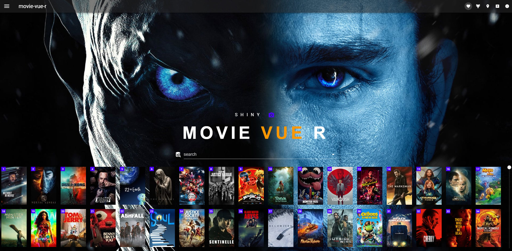
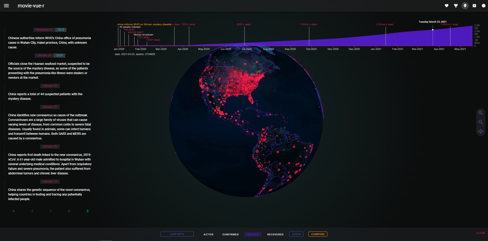
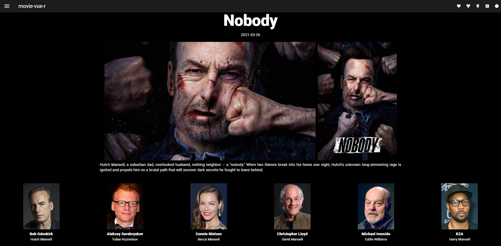
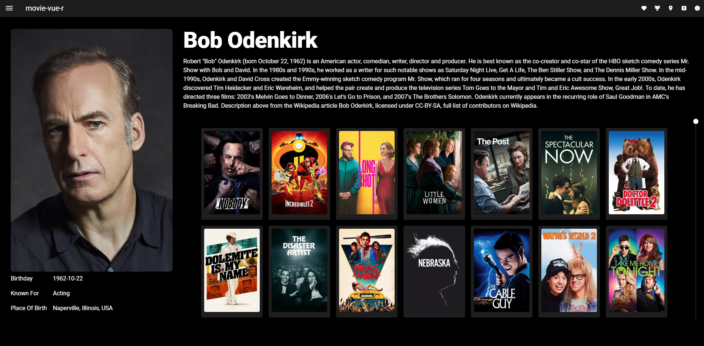
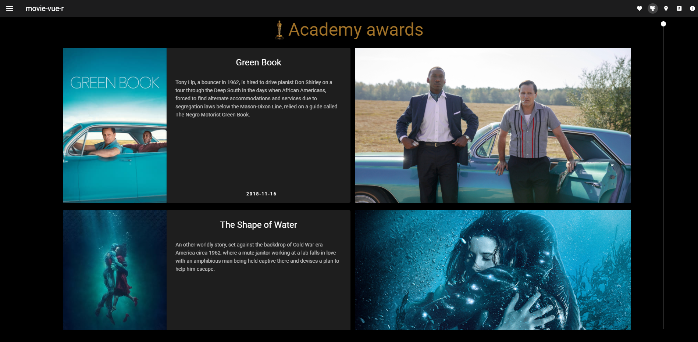
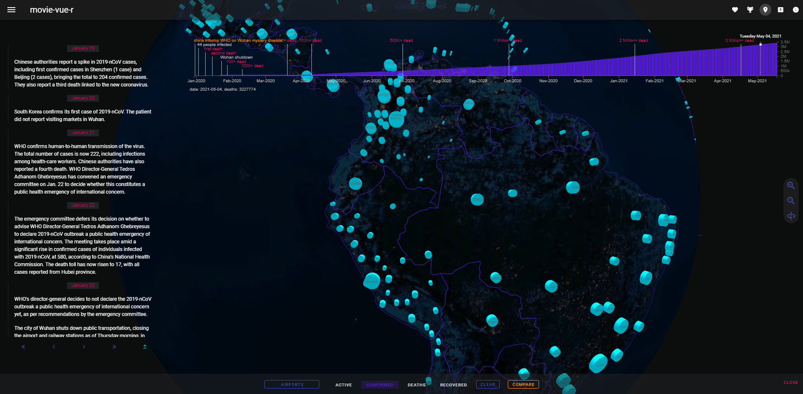
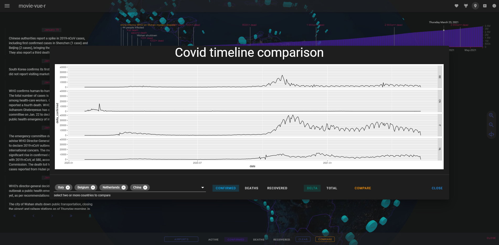
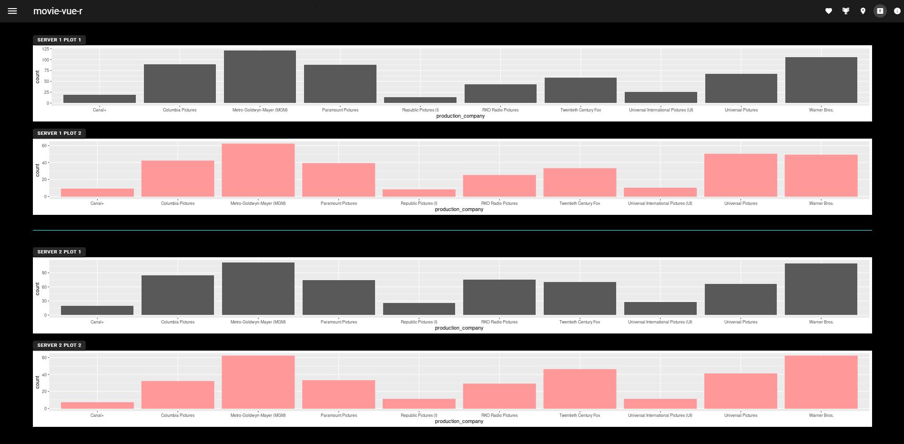
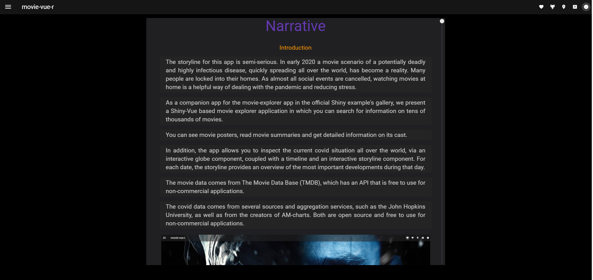
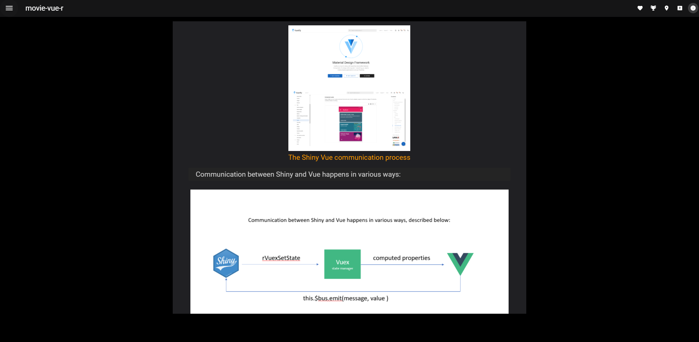

# shiny movie-vue-r

This repo contains the code for the Shiny app contest 2021 submission by Herman Sontrop and Kenton Russell. A live version of the app can be seen [here](https://friss.shinyapps.io/shiny-vue-r/  ) and the submission details can be found [here](https://community.rstudio.com/t/movie-vue-r-shiny-contest-submission/104905). The app also includes a Narrative page describing many important technical details.

### Description

In this work we take different perspective in creating a Shiny app than seen in most Shiny apps.

Instead of exploring and analyzing data, we explore the idea of creating a Shiny application using [Vue.js](https://vuejs.org/), a modern reactive front-end framework that allows you to compose extremely powerful apps using [Single File Components](https://vuejs.org/v2/guide/single-file-components.html).

 In this setup, only the server.R part of Shiny is used, while the ui part is completely taken over by Vue. For the visual design of our components we use [Vuetify](https://vuetifyjs.com/en/getting-started/installation/), a Material Design implementation especially for Vue.js, as well as  [d3.js](https://d3js.org/).

We  show that all reactive components of shiny are still fully functional and even that  outputs such as those generated by ggplot can still be used inside vue components. An update of this work will show the same for HTMLWidgets and Plotly outputs. 

As a deep analysis of data is not the goal of this project, the storyline for this app is taken to be semi-serious. 

In early 2020 a movie scenario of a potentially deadly and highly infectious disease, quickly spreading all over the world, has become a reality. Many people are locked into their homes. As almost all social events are cancelled, watching movies at home is a helpful way of dealing with the pandemic and reducing stress.

As a companion app for the movie-explorer app in the official Shiny example's gallery, we present a [Shiny](https://shiny.rstudio.com/) / [Vue.js](https://vuejs.org/) hybrid based movie explorer application in which you can search for information on tens of thousands of movies.

You can see movie posters, read movie summaries and get detailed information on its cast.

In addition, the app allows you to inspect the current covid situation all over the world, via an interactive globe component, coupled with a timeline and an interactive storyline component. For each date, the storyline provides an overview of the most important developments during that day.

####TL;DR

An extensive writeup of the details of this implementation will appear in this readme before the end of May 2021. The current text is just a very rough draft that is not complete or fully accurate with the current implementation. 

The current app is designed for HD screens with a resolution of 1920 x 1080 and will not render well on iPads or other heavily deviating screen sizes. This will be addressed in an update. 

In these updates we will also show how to hook up HTMLWidgets and Plotly outputs. Of note, this work is related to the [vueR](https://github.com/vue-r/vueR) work by [timelyportfolio](https://github.com/timelyportfolio) (a.k.a. Kenton Russell). VueR allows you to use Vue inside more classic shiny contexts using `tag` functions, while the app described in this work is based on the [Shiny HTMLTemplate](https://shiny.rstudio.com/articles/templates.html) approach, which utilizes HTML, CSS and JavaScript directly instead of letting R produce it.

Please see the in app Narrative (see screenshots below) for more details on the app creation process until this readme is completed (end May 2021). The in app Narrative includes details on the communication process between R and Vue (unfortunately due to a lack of time before the shiny contest deadline, this in app Narrative lacks some important details and explanations. These will be addressed in an update of this readme text).

##### What is it?

[Shiny](https://shiny.rstudio.com/) / [Vue.js](https://vuejs.org/) hybrid app using an [Shiny HTMLTemplate](https://shiny.rstudio.com/articles/templates.html) using [http-vue-loader](https://github.com/FranckFreiburger/http-vue-loader) to dynamically load Vue [Single File Components](https://vuejs.org/v2/guide/single-file-components.html) (SFCs), without the need for a build step. This is especially nice as now you can use scoped CSS in your components. We also show that ggplot outputs can still be used inside Vue components. 

The app uses:

1. [shiny](https://shiny.rstudio.com/)
2. [vue](https://vuejs.org/)
3. [vuetify](https://vuetifyjs.com/en/getting-started/installation/)
4. [material design icons](https://materialdesignicons.com/)
5. [http-vue-loader](https://github.com/FranckFreiburger/http-vue-loader)
6. [vuex](https://vuex.vuejs.org/guide/)
7. [vue-router](https://router.vuejs.org/)
8. [globe.gl](https://globe.gl/)
9.  [lodash.js](https://lodash.com/)
10. [d3.js](https://d3js.org/)
11. [mitt.js](https://github.com/developit/mitt)
12. [overlay scrollbars](https://github.com/KingSora/OverlayScrollbars)

##### Why create this?

The app shows advanced use of Vue in concert with R. Even though Shiny is great, especially if you are a web app novice or need to make app really fast without writing too much code, making more complex UIs or UX experiences becomes exceedingly more cumbersome when the app size grows. 

Most UI things are very easily done in Vue, while harder in R. jQuery is also quite old these days and better, more reactive UI frontend frameworks are now available.

This app shows intermediate Shiny enthusiasts how to expand their horizons to incorporate the power of modern JavaScript frameworks such as Vue and tap into the world of modern design systems like Material Design. 

The design philosophy of this app is simple: 

>Use Shiny as the hosting platform and as an *in memory*, *reactive* and *stateful*  backend system with web-socket communication to a Vue driven frontend. Data manipulation and data take-in is done via R, visualization and interaction via JavaScript. Instead of using HTMLWidgets, we compose the app using Vue components, utilizing the *Vuetify* component base, as well as using existing JavaScript libraries (without explicit bindings to R).

Inter-widget communication is done via: 

    - props (parent to child)
    - emitting events (child to parent)
    - vuex 
    - event bus (mitt.js)

R to JavaScript communication is done via `session$sendCustomMessage`, while JavaScript to R communication happens via `Shiny.setInputValue`.

The event bus is mostly used to send *event* updates, instead of app *state* updates.

R is especially good in manipulating data via e.g. the `tidyverse` packages. However, most fancy interactive graphics use `HTMLWidgets`, which in turn are R wrappers that use JavaScript components behind the scenes. 

Instead of creating a new widget for everything, one can more directly use existing JavaScript components. Compared to `HTMLWidgets`, Vue components also have more lifecycle hooks and much better HTML template support. 

Last, developers in other programming languages are more used to dealing with UI components written directly in HTML, CSS and JavaScript. Even though much of the code can be written using R/Shiny `tags$` functions just fine, most non-R coders find this style unattractive, which makes certain collaborations harder. 

The R to Javascript communication uses the helpers `rVuexSetState`, `rBus` and `rVuex` (see r2Vue.R).

Vue components use computed properties to listen for store state changes.

All data is send via R.
##### Required packages
- shiny
- httr
- jsonlite
- tidyverse
- TMDb
##### Data

A small toy dataframe is based on the [Kaggle IMDB movies extensive dataset](https://www.kaggle.com/stefanoleone992/imdb-extensive-dataset). This will be used to do in memory computation via `tidyverse` and `igraph`. 

We also pull data via an API from [The Movie DataBase](https://www.themoviedb.org/) using the `httr` package and using the `TMDb` RData package. See `data/tmdb_schema.json` for request url details.

Finally, we pull in covid data from AM Charts and the John Hopkins university (to be described).