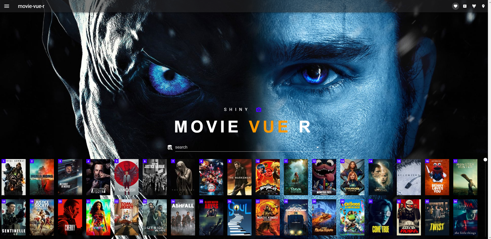

# shiny-movie-vue-r

shiny vue hybrid app using an HTMLTemplate and vue.

The app uses:

1. [vue](https://vuejs.org/)
2. [vuetify](https://vuetifyjs.com/en/getting-started/installation/)
3. [material design icons](https://materialdesignicons.com/)
4. [vuex](https://vuex.vuejs.org/guide/)
5. [vue-i18n](https://kazupon.github.io/vue-i18n/) 
6. [billboard.js](https://naver.github.io/billboard.js/)
7. [lodash](https://lodash.com/)
8. [d3](https://d3js.org/)
9. [mitt.js](https://github.com/developit/mitt) event emitter
     
    
The app communicates from R to JavaScript via both an event bus (mitt) and via vuex.

The R to Javascript communication uses the helpers `rBus` and `rVuex`.

Vue components use computed properties to listen for store state changes.

A small toy dataframe is based on the [Kaggle IMDB movies extensive dataset](https://www.kaggle.com/stefanoleone992/imdb-extensive-dataset).

We also pull data via an API from [The Movie DataBase](https://www.themoviedb.org/) using the `httr` package. 

The example app shows a ggplot2 graph, an image which url is send via R, an i18n 'hello world' example, a c3 (billboard) based bar chart and a data table with fixed headers.

All data is send via R.

